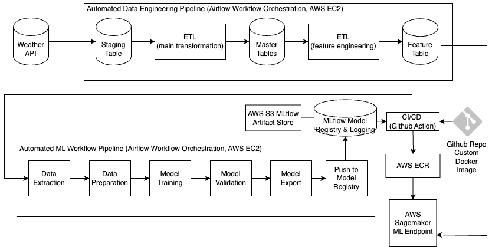
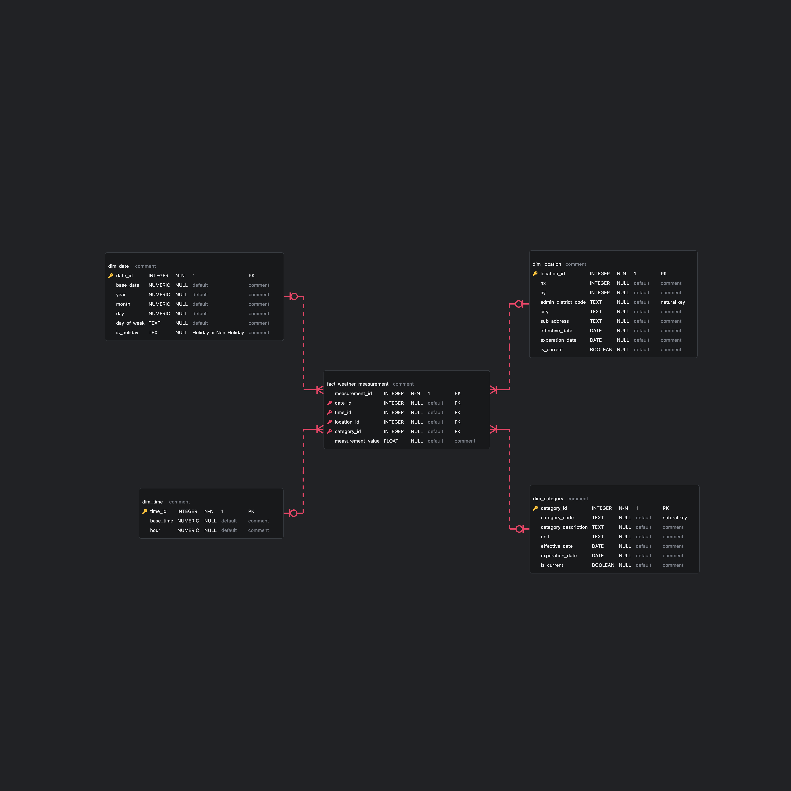

# MLOps Level1 - Continuous Training Pipeline
This Project showcase Automation of ML workflow from scratch.
- ETL pipeline from API to Master tables.
- Feature Engineering Pipeline.
- Automated ML model training pipeline.
- Continuous Training: Transition staging model to production model, followed by triggering github action to deploy model to AWS Sagemaker Endpoint.


## MLOps Level 1 - System Architecture


## Technologies Used
- Apache Airflow: Workflow orchestration
- MLflow: Model tracking and model lifecycle management
- AWS SageMaker: Model deployment
- Docker: Containerization
- GitHub Actions: CI/CD pipeline

## Tutorial
Watch the step-by-step tutorial on YouTube: [MLOps Level 1 - Continuous Training Pipeline Tutorial](https://www.youtube.com/@codingwithsun)


## Prerequisites
- Python 3.12+
- Docker and Docker Compose
- AWS Account with SageMaker access
- API credentials for weather data
- Git

## Project Structure
```
.
├── dags/              # Airflow DAGs for workflow orchestration
├── mlflow/            # MLflow tracking and model management
├── config/            # Configuration files
├── plugins/           # Custom Airflow plugins
├── images/            # Documentation images
└── requirements.txt   # Python dependencies
```

## Pipeline Components

### 1. ETL Pipeline
- Fetches weather data from API
- Transforms and loads data into master tables
- Handles data validation and error checking

### 2. Feature Engineering
- Processes raw data into model features
- Handles missing values and outliers
- Creates time-based features

### 3. Model Training
- Automated training pipeline
- Model versioning with MLflow
- Performance tracking and comparison

### 4. Model Deployment
- GitHub Actions workflow for automated deployment: [deploy-model-sagemaker](https://github.com/sunse-kwon/deploy-model-sagemaker)

## Monitoring and Maintenance
- Monitor pipeline health through Airflow UI
- Track model performance in MLflow
- Set up alerts for pipeline failures
- Regular model retraining based on date

## Troubleshooting
Common issues and solutions:
1. Pipeline failures
   - Check Airflow logs
   - Verify API connectivity
   - Ensure AWS credentials are valid

2. Model deployment issues
   - Verify SageMaker endpoint status
   - Check model artifacts in MLflow
   - Review deployment logs


## Reference
### Input Data Example (Weather API Response)
```
{
    "response": {
        "header": {
            "resultCode": "00",
            "resultMsg": "NORMAL_SERVICE"
        },
        "body": {
            "dataType": "JSON",
            "items": {
                "item": [
                    {
                        "baseDate": "20250313",
                        "baseTime": "0000",
                        "category": "PTY",
                        "nx": 86,
                        "ny": 106,
                        "obsrValue": "0"
                    },
                    {
                        "baseDate": "20250313",
                        "baseTime": "0000",
                        "category": "RN1",
                        "nx": 86,
                        "ny": 106,
                        "obsrValue": "0"
                    },
                    {
                        "baseDate": "20250313",
                        "baseTime": "0000",
                        "category": "T1H",
                        "nx": 86,
                        "ny": 106,
                        "obsrValue": "6.4"
                    },
                ]
            },
            "pageNo": 1,
            "numOfRows": 10,
            "totalCount": 8
        }
    }
}
```

### Data Model (ERD) - Master Tables 



