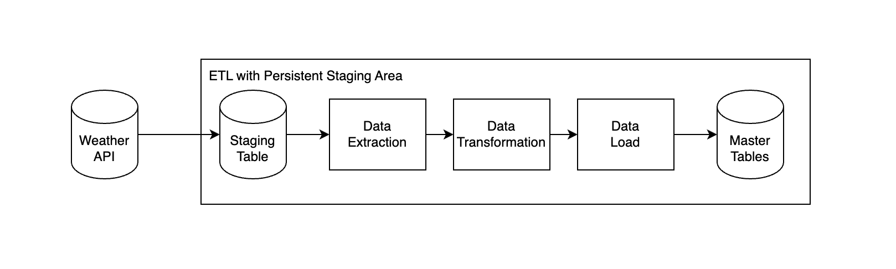

# airflow-docker-AWS
setup airflow docker infrastructure on AWS EC2 for further ETL pipeline build and operation for project


ETL pipeline architecture

## input data
- data struecture
    - API response sample
```
{
    "response": {
        "header": {
            "resultCode": "00",
            "resultMsg": "NORMAL_SERVICE"
        },
        "body": {
            "dataType": "JSON",
            "items": {
                "item": [
                    {
                        "baseDate": "20250313",
                        "baseTime": "0000",
                        "category": "PTY",
                        "nx": 86,
                        "ny": 106,
                        "obsrValue": "0"
                    },
                    {
                        "baseDate": "20250313",
                        "baseTime": "0000",
                        "category": "REH",
                        "nx": 86,
                        "ny": 106,
                        "obsrValue": "77"
                    },
                    {
                        "baseDate": "20250313",
                        "baseTime": "0000",
                        "category": "RN1",
                        "nx": 86,
                        "ny": 106,
                        "obsrValue": "0"
                    },
                    {
                        "baseDate": "20250313",
                        "baseTime": "0000",
                        "category": "T1H",
                        "nx": 86,
                        "ny": 106,
                        "obsrValue": "6.4"
                    },
                    {
                        "baseDate": "20250313",
                        "baseTime": "0000",
                        "category": "UUU",
                        "nx": 86,
                        "ny": 106,
                        "obsrValue": "-0.1"
                    },
                    {
                        "baseDate": "20250313",
                        "baseTime": "0000",
                        "category": "VEC",
                        "nx": 86,
                        "ny": 106,
                        "obsrValue": "170"
                    },
                    {
                        "baseDate": "20250313",
                        "baseTime": "0000",
                        "category": "VVV",
                        "nx": 86,
                        "ny": 106,
                        "obsrValue": "1.1"
                    },
                    {
                        "baseDate": "20250313",
                        "baseTime": "0000",
                        "category": "WSD",
                        "nx": 86,
                        "ny": 106,
                        "obsrValue": "1.1"
                    }
                ]
            },
            "pageNo": 1,
            "numOfRows": 10,
            "totalCount": 8
        }
    }
}
```

## output data

### output data structure
- Star Schema


## transformation
- standards : lower case, units
- data type change: convert numeric->decimal
- normalization: business rule, e.g validate category
- deduplication: prevent duplicate values in fact table
- integrity check : foreign key constraints
- corrections
    - null value?
    - missing value, outliers, invalid valuees


## system architecture


## ETL design for this project
- ETL with Persistant Staging Area
